# 📝 TaskMate - Aplikasi Pengelola Tugas Cerdas (UTS Pemrograman Mobile 2)

TaskMate adalah aplikasi Android modern yang dirancang untuk membantu pengguna mengelola tugas dan deadline dengan bantuan kecerdasan buatan (AI). Aplikasi ini dibuat untuk memenuhi tugas **UTS Mata Kuliah Pemrograman Mobile 2**.

**Dosen Pengampu:** Donny Maulana, S.Kom., M.M.S.I.  
**Instansi:** Universitas Pelita Bangsa

---

## 🚀 Fitur Utama

-   **🤖 AI Smart Assistant (Groq AI)**:
    -   **Subtask Generator**: Memecah tugas besar menjadi langkah-langkah kecil secara otomatis.
    -   **Smart Categorization**: Otomatis menentukan kategori dan prioritas berdasarkan judul tugas.
    -   **AI Daily Briefing**: Ringkasan tugas harian yang dibacakan melalui Text-to-Speech (TTS).
-   **☁️ Cloud Synchronization**: Sinkronisasi data real-time dengan Firebase Firestore.
-   **📂 Google Drive Integration**: Simpan lampiran file tugas (gambar/dokumen) langsung ke Google Drive Anda.
-   **📸 OCR Scan Task**: Buat tugas otomatis hanya dengan memfoto teks/dokumen menggunakan ML Kit.
-   **⏱️ Focus Timer**: Fitur Pomodoro untuk membantu Anda fokus mengerjakan tugas.
-   **🌙 Dark Mode Support**: Tampilan yang nyaman di mata untuk penggunaan malam hari.
-   **🔔 Real-time Notifications**: Pengingat deadline agar tidak ada tugas yang terlewat.

---

## 📸 Showcase UI

| Splash Screen | Welcome | Login |
| :---: | :---: | :---: |
| 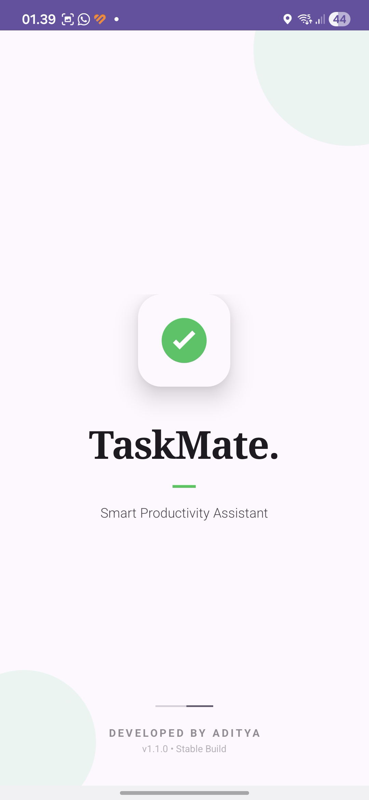 | 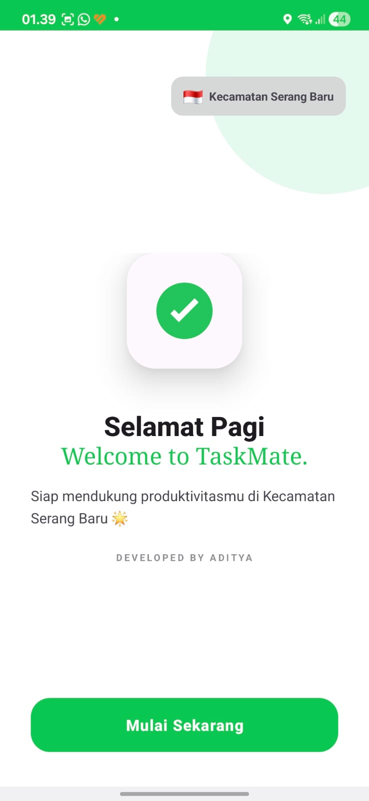 | 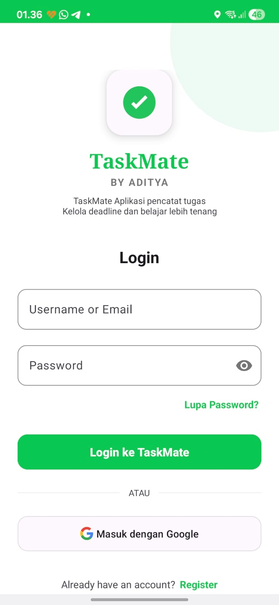 |

| Google Auth | Home Screen | Speed Dial |
| :---: | :---: | :---: |
| 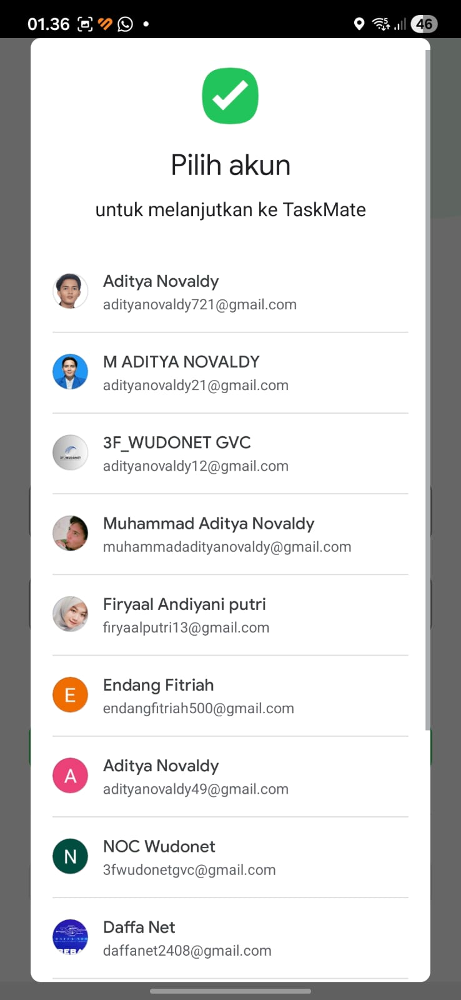 | 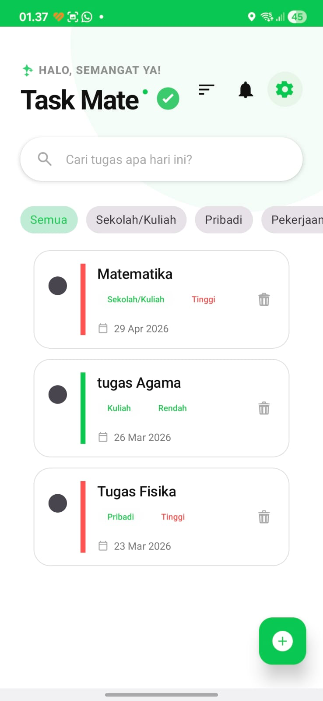 | 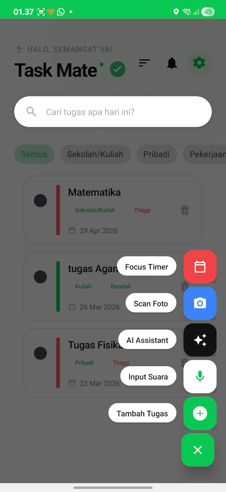 |

| Detail (Atas) | Detail (AI) | AI Chat Assistant |
| :---: | :---: | :---: |
| 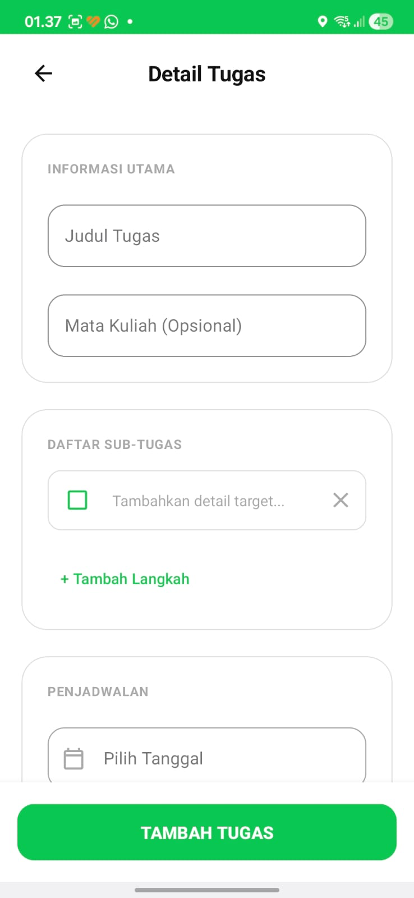 | 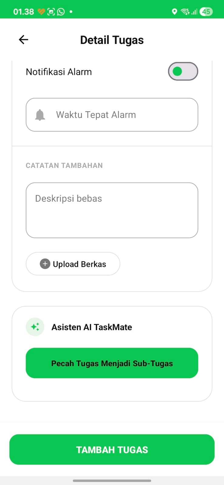 | 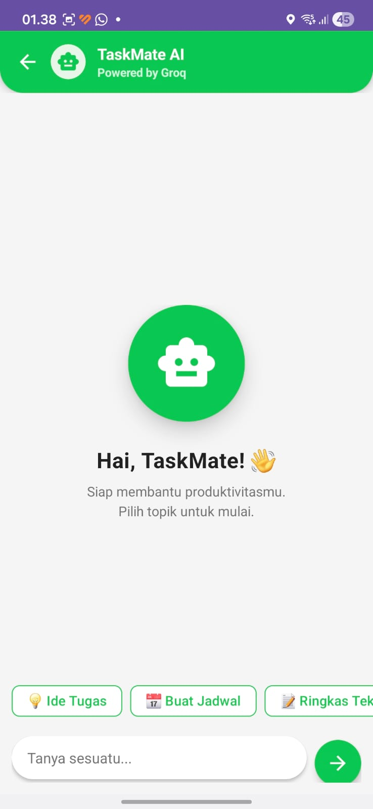 |

| Profile & Stats | Settings & Version | Analytics Dashboard |
| :---: | :---: | :---: |
| 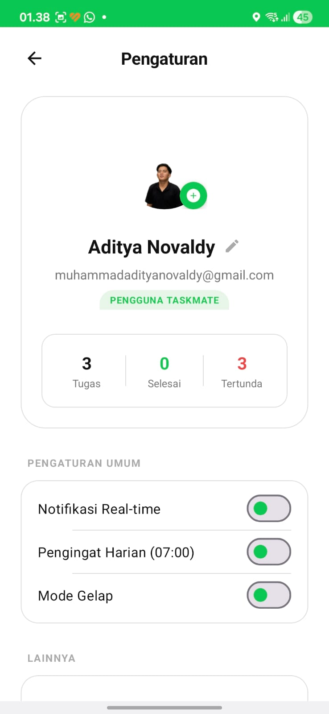 | 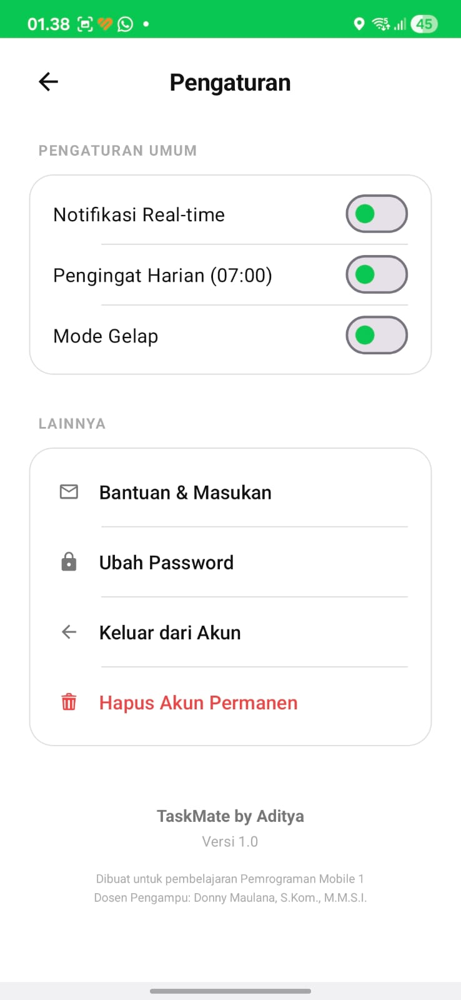 | 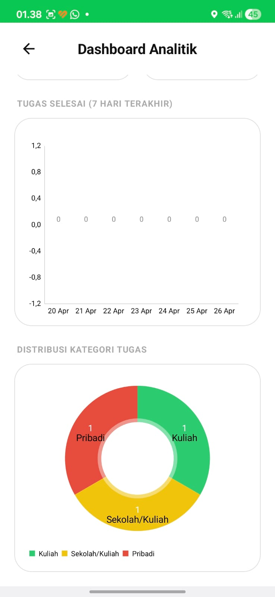 |

---

## 🛠️ Teknologi & Library

-   **Bahasa**: Java
-   **Database**: Room (Lokal) & Firebase Firestore (Cloud)
-   **Architecture**: MVVM (ViewModel, LiveData, Repository)
-   **AI Engine**: Groq SDK (Llama 3.1 Model)
-   **OCR**: Google ML Kit Text Recognition
-   **Image Loading**: Glide
-   **Networking**: OkHttp3
-   **Authentication**: Firebase Auth & Google Sign-In

---

## ⚙️ Cara Instalasi

1. Clone repository ini:
   ```bash
   git clone https://github.com/adafi13/TaskMate.git
   ```
2. Buka proyek di **Android Studio (Ladybug atau versi terbaru)**.
3. Tambahkan file `local.properties` di root project dan masukkan API Key Anda:
   ```properties
   GROQ_API_KEY=YOUR_API_KEY_HERE
   ```
4. Pastikan file `google-services.json` sudah ada di folder `app/`.
5. Sync Gradle dan Run aplikasi.

---

## 👨‍💻 Kontributor

-   **Nama**: Muhammad Aditya Novaldy
-   **Kelas**: I242A
-   **NIM**: 312410360
-   **Instansi**: Universitas Pelita Bangsa

---
© 2026 TaskMate by Aditya.
